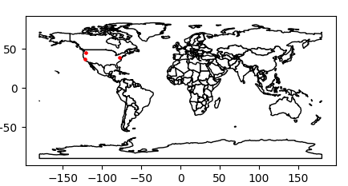

# flask-geomapper
Visualize Flask request locations cartographically.

This python library allows you to map Flask request locations on a map using their IPs. This allows you to get a better understanding of your users and audience. \
Example map:

    

## Installation

    pip3 install flask-geomapper

## Demo
[https://flask-geomapper.herokuapp.com](https://flask-geomapper.herokuapp.com) (locations cleared periodically). Source can be found at "examples/heroku".

## Quickstart
Here is a simple example of flask-geomapper. An explaination can be found in "examples/basic.py".

    import flask
    from flask_geomapper import flask_geomapper

    app = flask.Flask(__name__)
    fg = flask_geomapper(app, count_trigger=app.before_request, debug=True) 

    @app.route("/")
    def show_map():
        return flask.send_file(fg.get_img(), mimetype="image/png")

    app.run(debug=True, use_reloader=False)

## Examples
Examples can be found in the examples directory.

Basic usage: "basic.py" \
AWS S3 integration: "aws_s3.py" \
Modifying count triggers: "count_triggers.py" \
Clear old locations: "remove_first_location_on_interval.py" \
Ignore routes and status codes: "ignore_routes_and_statuses.py" \
Manually add locations: "manual_history_append.py"
Heroku deployment: "heroku/"

## Commercial usage
For commercial usage, you must use an API key at [members.ip-api.com](https://members.ip-api.com). 